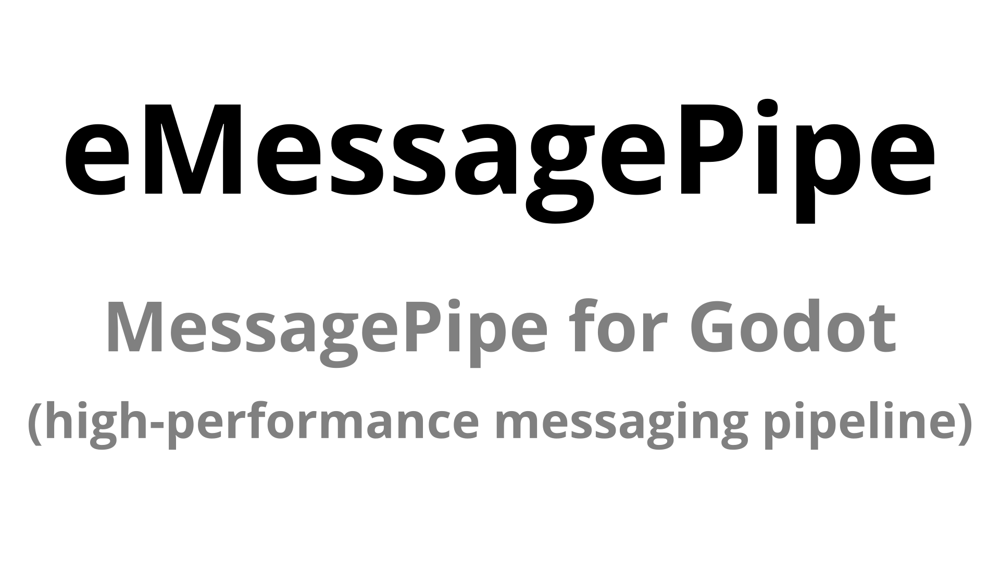

<div align="center">



# eMessagePipe

**[MessagePipe](https://github.com/Cysharp/MessagePipe) support for [Godot](https://godotengine.org/) .NET projects,
with an optional integration for [eContainer](https://github.com/enaweg/godot-econtainer).**

[](https://github.com/enaweg/godot-emessagepipe/actions/workflows/ci-pr.yml)


**NOTE**: This project is experimental and still a work in progress.

</div>

## What is MessagePipe?

[MessagePipe](https://github.com/Cysharp/MessagePipe) is Cysharp's high-performance in-memory/distributed messaging
library for .NET and Unity. Instead of wiring senders directly to receivers (or to Godot signals), a component asks the
DI container for a typed publisher or subscriber and talks to a *message type*. Publisher and subscriber never learn
about each other, which keeps scenes, services and systems decoupled and independently testable.

When [eContainer](https://github.com/enaweg/godot-econtainer) is enabled, eMessagePipe integrates MessagePipe 1.8.2
into its scopes, so publishers and subscribers resolve from the same `LifetimeScope` as the rest of your registrations.
Without eContainer, eMessagePipe still installs the MessagePipe packages, and you can use MessagePipe with another
dependency injection setup.

### Major features

+ **Typed publish/subscribe** — `IPublisher<TMessage>` / `ISubscriber<TMessage>` replace events and signal strings with
  a message type. Subscribing returns an `IDisposable`; `DisposableBag` bundles many subscriptions into one dispose call,
  which maps cleanly onto a node's `_ExitTree`.
+ **Keyed (topic) brokers** — `IPublisher<TKey, TMessage>` / `ISubscriber<TKey, TMessage>` route the same message type by
  key, so one broker can serve many entities, channels or states.
+ **Async publish/subscribe** — `IAsyncPublisher<TMessage>` / `IAsyncSubscriber<TMessage>` await every handler.
  `MessagePipeOptions.DefaultAsyncPublishStrategy` selects `Parallel` or `Sequential` handler execution, and
  `PublishAsync` accepts a `CancellationToken`.
+ **Buffered brokers** — `IBufferedPublisher<TMessage>` / `IBufferedSubscriber<TMessage>` retain the most recent message
  and replay it to new subscribers, which suits state-like values (current health, current game phase) where a late
  subscriber still needs the last known value.
+ **Request/response handlers** — `IRequestHandler<TRequest, TResponse>` and its async counterpart give a mediator-style
  one-to-one call; `IRequestAllHandler<TRequest, TResponse>` fans the request out to every registered handler and
  collects the responses.
+ **Filters** — `MessageHandlerFilter<T>`, `AsyncMessageHandlerFilter<T>`, `RequestHandlerFilter<T>` and their async
  variants form an ordered middleware pipeline around handlers, for cross-cutting concerns such as logging, validation,
  predicate-based filtering or de-duplication. Filters are themselves resolved from the container and can be attached
  globally, per subscription, or by attribute.
+ **Performance-oriented design** — handler invocation goes through array-based broker cores rather than reflection or
  delegate chains, keeping publish paths allocation-light; MessagePipe's own benchmarks put it well ahead of plain C#
  events and Rx-style pipelines.
+ **Diagnostics** — `MessagePipeDiagnosticsInfo` reports live subscription counts, and
  `MessagePipeOptions.EnableCaptureStackTrace` records where each subscription was created, which makes leaked
  subscriptions findable.
+ **`MessagePipe.Analyzer`** — a Roslyn analyzer, installed alongside the library, whose `MPA001` diagnostic reports a
  discarded `IDisposable` from `Subscribe` — the most common source of subscription leaks.

Two upstream notes specific to the eContainer integration: VContainer resolves closed generics only, so every message
type is registered explicitly (see [Examples](#examples)) rather than through MessagePipe's open-generic
auto-registration; and MessagePipe's distributed transports (Redis, in-process, WebSocket, gRPC/MagicOnion) ship as
separate packages that eMessagePipe does not install.

## Requirements

The current CI-tested configuration uses:

+ [Godot 4.7.2 .NET](https://godotengine.org/download/archive/4.7.2-stable/)
+ [.NET 8 SDK](https://dotnet.microsoft.com/download/dotnet/8.0)
+ [ePlugin Framework](https://github.com/enaweg/godot-epluginframework)
+ [eContainer](https://github.com/enaweg/godot-econtainer) (optional; required for the VContainer integration)

The project targets `net8.0` by default and `net9.0` for Android builds.

## Installation

1. Install and enable [ePlugin Framework](https://github.com/enaweg/godot-epluginframework) in your Godot .NET project.
   Install and enable [eContainer](https://github.com/enaweg/godot-econtainer) as well if you want its VContainer
   integration.
2. Download the latest eMessagePipe [release](https://github.com/enaweg/godot-emessagepipe/releases) and extract the
   archive's `addons/eMessagePipe` directory into your Godot project's `addons` directory. For development, clone this
   repository instead.
3. Open the project in the Godot .NET editor and enable **eMessagePipe** under **Project > Project Settings > Plugins**.
4. Let ePlugin complete the package installation and project reload.

The plugin adds the `MessagePipe` and `MessagePipe.Analyzer` NuGet packages to the Godot C# project. On the current
`main` branch, when eContainer is enabled, ePlugin also makes the optional integration source in `.src-econtainer`
available. eContainer can be enabled before or after eMessagePipe; its integration source is added and removed as the
optional dependency changes state.

The latest published prerelease, v0.2.0 (as of 29 September 2026), predates the optional eContainer integration and
still requires eContainer. To use the optional integration before it is released, copy
`src/emessagepipe/addons/eMessagePipe` from the current `main` branch into your project's `addons` directory and rename
its `src` directory to `.src-econtainer` before opening the project in Godot. This is the same layout produced by the
release workflow.

The repository also contains a sample project in `src/emessagepipe`.

## Features

+ Optional MessagePipe registration for eContainer's VContainer-based `LifetimeScope`
+ Publish/subscribe brokers: synchronous, asynchronous, and buffered variants
+ Keyed publish/subscribe brokers
+ Request handlers (synchronous and asynchronous) and MessagePipe filters
+ Self-installing NuGet packages via ePlugin Framework

## Motivation

The optional eContainer integration connects MessagePipe's `IServiceCollection` registration to VContainer's
`IContainerBuilder`, so `IPublisher<T>` and `ISubscriber<T>` resolve from the same eContainer scope as other services.
It does not create a separate service provider that must be kept in sync with the scene tree. If eContainer is not
enabled, eMessagePipe only installs the MessagePipe packages and does not add the VContainer bridge.

## Testing

This project needs more testing to move forward. Feel free to participate and provide feedback.

The current CI configuration builds and tests pull requests with Godot 4.7.2 and .NET 8, with the sample project's
eContainer integration enabled.

Tested combinations:

+ Godot 4.7.2 + .NET 8 (CI-tested)

To build and run the tests locally:

```bash
cd src/emessagepipe
export GODOT_BIN="$(command -v godot)" # point this to your Godot .NET executable
dotnet restore eMessagePipe.sln
dotnet build eMessagePipe.sln --configuration Debug --no-restore
"$GODOT_BIN" --path . --editor --headless --quit-after 2000
dotnet test eMessagePipe.sln --configuration Debug --no-build --settings .runsettings
```

Godot must be available when running the tests.
See the [CI workflow](https://github.com/enaweg/godot-emessagepipe/blob/main/.github/workflows/ci-pr.yml)
for the complete headless test setup, including `xvfb-run` for the test step on Linux.

gdUnit is used as the test framework.

## Examples

### Example Code (Registration)

Register MessagePipe in an eContainer `LifetimeScope`, then register every message type used by that scope.

```C#
using Enaweg.Container.Godot;
using Enaweg.MessagePipe;
using VContainer;

public sealed class PlayerDied { }

public partial class GameLifetimeScope : LifetimeScope
{
    protected override void Configure(IContainerBuilder builder)
    {
        var options = builder.RegisterMessagePipe();
        builder.RegisterGlobalMessagePipe(); // root scope: enables GlobalMessagePipe and diagnostics

        // closed message-type services for PlayerDied
        builder.RegisterMessageBroker<PlayerDied>(options);

        // keyed publishers and subscribers
        builder.RegisterMessageBroker<string, PlayerDied>(options);
    }
}
```

`RegisterMessageBroker<TMessage>(options)` registers the following closed message-type services:

+ `IPublisher<TMessage>` and `ISubscriber<TMessage>`
+ `IAsyncPublisher<TMessage>` and `IAsyncSubscriber<TMessage>`
+ `IBufferedPublisher<TMessage>` and `IBufferedSubscriber<TMessage>`
+ `IBufferedAsyncPublisher<TMessage>` and `IBufferedAsyncSubscriber<TMessage>`

Request handlers and filters are available through `RegisterRequestHandler`, `RegisterAsyncRequestHandler`, and the
corresponding `Register*Filter` extensions.

Call `RegisterMessagePipe` once per `LifetimeScope` that registers MessagePipe services, then pass its returned
`MessagePipeOptions` to broker and request-handler registrations. The keyed
`RegisterMessageBroker<TKey, TMessage>(options)` overload registers both synchronous and asynchronous publishers and
subscribers. Broker registrations use `options.InstanceLifetime`; request handlers use
`options.RequestHandlerLifetime`. You can configure these through `RegisterMessagePipe(options => ...)`.

`RegisterRequestHandler<TRequest, TResponse, THandler>(options)` and
`RegisterAsyncRequestHandler<TRequest, TResponse, THandler>(options)` also provide the corresponding `IRequestAllHandler`
or `IAsyncRequestAllHandler` entry point when multiple handlers share a request type. The bridge provides separate
registration methods for message, async message, request and async request filters.

Call `RegisterGlobalMessagePipe()` only from the root scope if you use `GlobalMessagePipe` or its diagnostics window:
it sets MessagePipe's process-wide provider when the scope is built. For MessagePipe registration extensions written
for Microsoft DI, `builder.AsServiceCollection()` forwards service descriptors to VContainer and
`builder.ToMessagePipeBuilder()` exposes MessagePipe's builder API. The service-collection bridge cannot remove a
registration once forwarded, so `Remove`, `RemoveAt` and `Clear` are unsupported.

### Example Code (Publishing)

Resolve or inject `IPublisher<TMessage>` and `ISubscriber<TMessage>` from the same VContainer scope:

```C#
using MessagePipe;

public sealed class ScoreService
{
    private readonly IPublisher<PlayerDied> playerDied;

    public ScoreService(IPublisher<PlayerDied> playerDied)
    {
        this.playerDied = playerDied;
    }

    public void OnPlayerDied()
    {
        playerDied.Publish(new PlayerDied());
    }
}
```

Subscriptions are disposable. Keep the returned `IDisposable` for as long as the receiver needs messages, and dispose
it when the receiver leaves its scope (for a Godot node, `_ExitTree` is a natural place):

```C#
using System;
using MessagePipe;

public sealed class PlayerDeathListener : IDisposable
{
    private readonly IDisposable subscription;

    public PlayerDeathListener(ISubscriber<PlayerDied> playerDied)
    {
        subscription = playerDied.Subscribe(_ => Console.WriteLine("Player died"));
    }

    public void Dispose() => subscription.Dispose();
}
```

## Related projects

+ [godot-epluginframework](https://github.com/enaweg/godot-epluginframework)
+ [godot-econtainer](https://github.com/enaweg/godot-econtainer)
+ [godot-elogger](https://github.com/enaweg/godot-elogger)

## Contribute

Feel free to contribute with documentation, testing, or pull requests.

## Roadmap

* stabilize current API
* improve documentation
* expand automated testing

## Commercial Support

Commercial services are available from [Enaweg](https://www.enaweg.at). If you need consulting, implementation
assistance, or tailored development services, please get in touch through their website.

## License

Licensed under the [MIT license](LICENSE).
